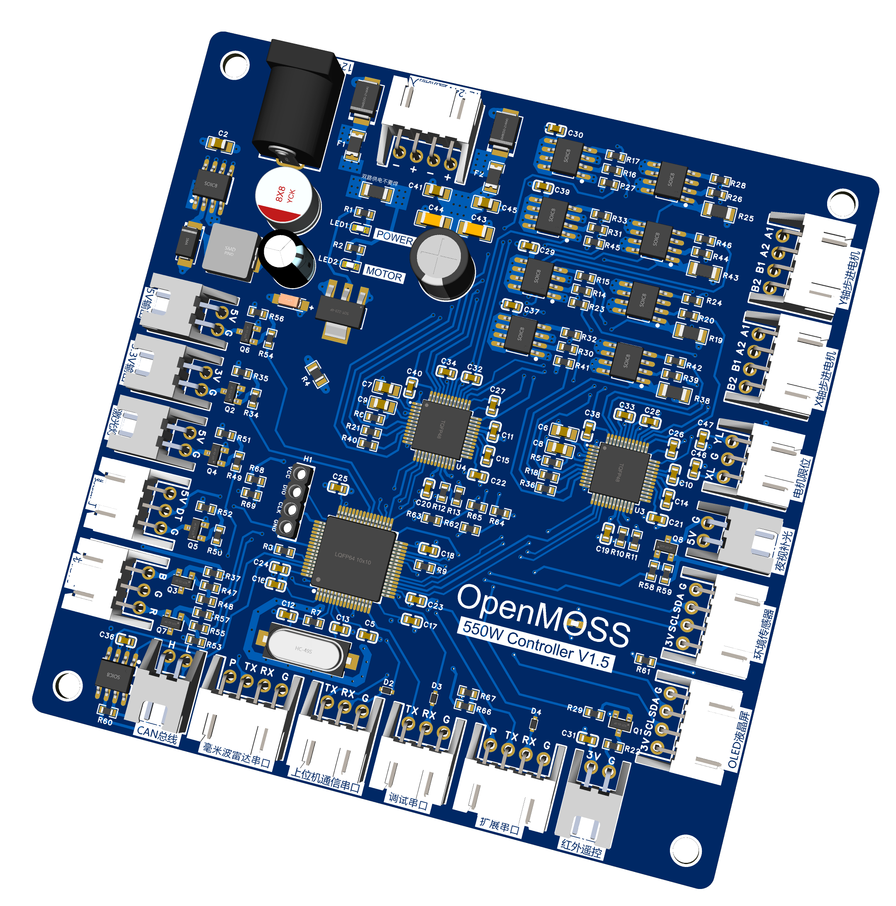

# MOSS Controller PCB

## 简介

moss-controller-pcb是[OpenMOSS](https://github.com/open-moss)的下位机PCB工程（立创EDA）采用四层板布线，主控为STM32F103RCT6。

固件请从[moss-controller-fireware](https://github.com/open-moss/moss-controller-fireware)拉取

OpenMOSS交流群：238111072

| [了解OpenMOSS](https://github.com/open-moss) | [开发计划](#开发计划) |

## 功能概述

- 🚀 支持12-24v宽压输入

- 🚀 支持驱动双路步进电机

- 🚀 支持采集温湿度

- 🚀 支持OLED液晶屏驱动

- 🚀 支持红外遥控发射

## PCB预览图

